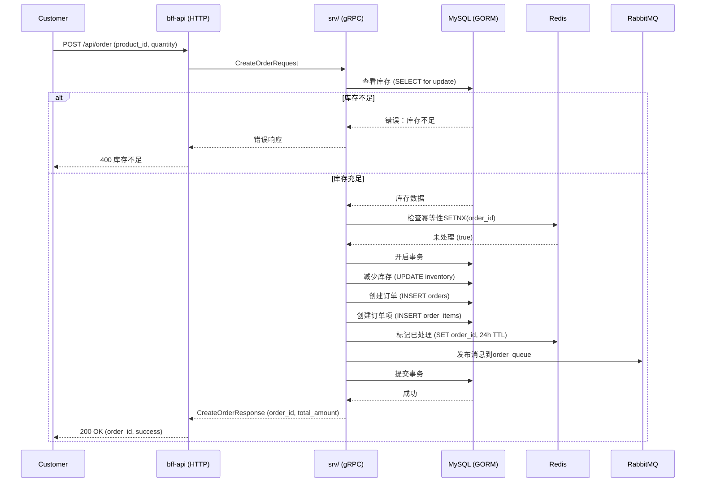
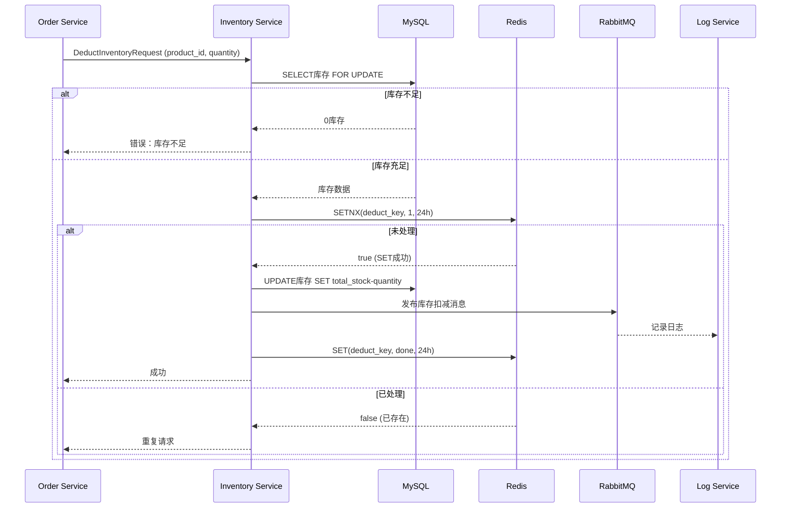
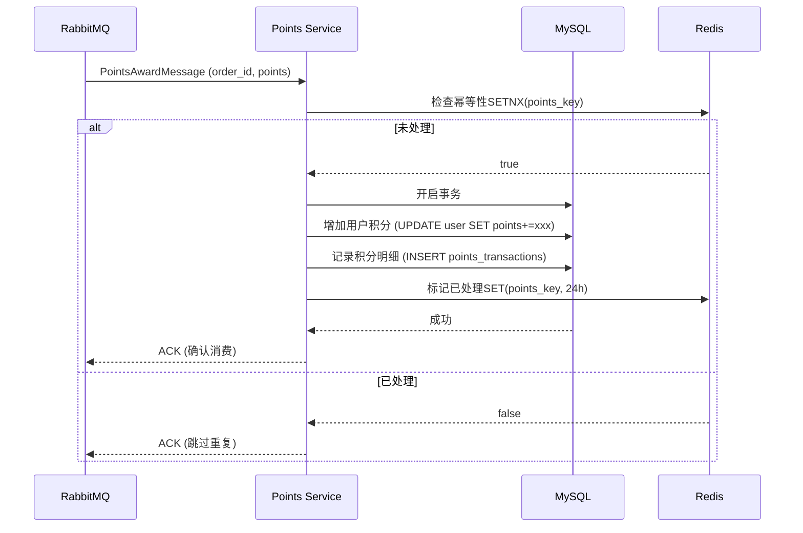
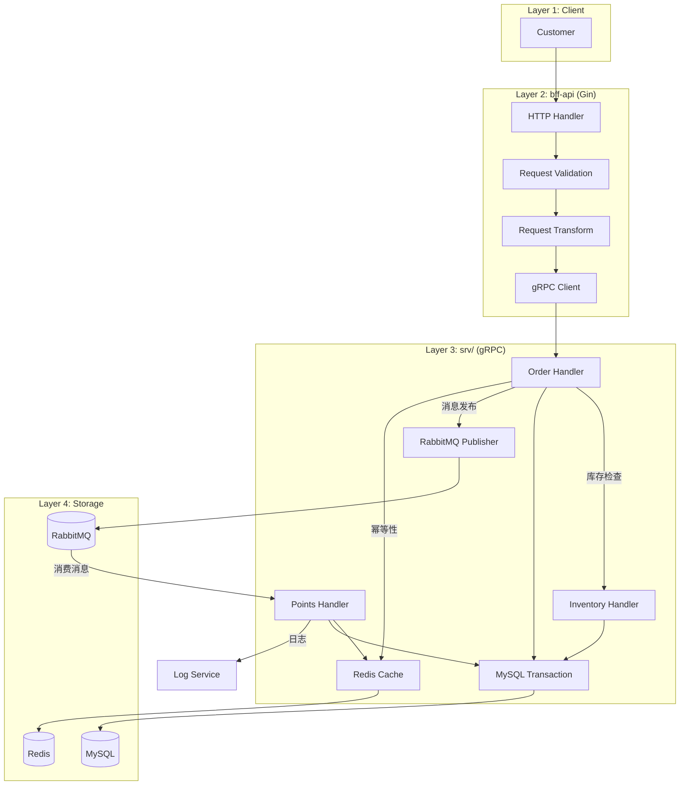
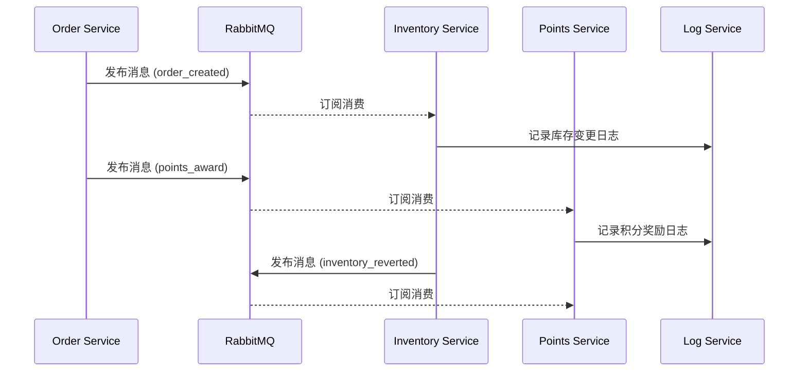
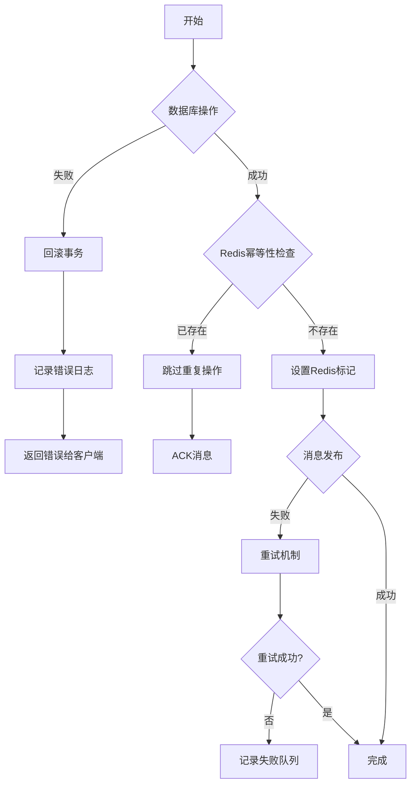

# E-commerce System Flow Diagrams

## 系统架构

```
┌─────────────────────────────────────────────────────────────────────┐
│                         Client (浏览器/APP)                          │
└────────────────────────────────┬────────────────────────────────────┘
                                 │ HTTP Request
                                 ▼
┌─────────────────────────────────────────────────────────────────────┐
│                        bff-api/ (Gin HTTP)                          │
│                    port: 8080 (HTTP Server)                         │
└────────────────────────────────┬────────────────────────────────────┘
                                 │ gRPC
                                 ▼
┌─────────────────────────────────────────────────────────────────────┐
│                        srv/ (gRPC Services)                         │
│                  port: 50051 (gRPC Server)                          │
│  ┌──────────────┐  ┌──────────────┐  ┌──────────────┐               │
│  │  OrderService│  │InventoryService││ PointsService│               │
│  └──────────────┘  └──────────────┘  └──────────────┘               │
└────────────────────────────────┬────────────────────────────────────┘
                                 │
        ┌────────────────────────┼────────────────────────┐
        │                        │                        │
        ▼                        ▼                        ▼
┌──────────────────┐    ┌──────────────────┐    ┌──────────────────┐
│   MySQL (GORM)   │    │  Redis (幂等性)  │    │   RabbitMQ       │
│   - User         │    │  - 消息判重      │    │   - order_queue  │
│   - Product      │    │  - 临时缓存      │    │   - inventory_q  │
│   - Order        │    │                  │    │   - points_queue │
│   - Inventory    │    │                  │    │                  │
│   - OrderItems   │    │                  │    │                  │
└──────────────────┘    └──────────────────┘    └──────────────────┘
```

---

## 1. 订单全流程 (Order Full Process)

### Sequence Diagram



### Data Flow

```
HTTP Layer (bff-api/handler/)
├── request/
│   └── order_create_request.go
├── response/
│   └── order_create_response.go
└── service/
    └── order_service.go (调用gRPC)

gRPC Layer (srv/handler/)
├── order_handler.go
│   ├── 1. 检查库存 (MySQL SELECT)
│   ├── 2. 幂等性检查 (Redis SETNX)
│   ├── 3. 事务处理
│   │   ├── 减少库存 (UPDATE)
│   │   ├── 创建订单 (INSERT)
│   │   └── 创建订单项 (INSERT)
│   └── 4. 发布消息 (RabbitMQ)

MySQL (srv/model/)
├── user.go
├── product.go
├── order.go (gorm.Model + 订单字段)
├── order_items.go (订单项)
└── inventory.go (库存)

Redis: mq:processed:{order_id_md5} (24h TTL)
```

---

## 2. 库存扣减流程 (Inventory Deduction Flow)

### Sequence Diagram



### Data Flow

```
库存扣减流程:
1. 幂等性检查 (Redis SETNX)
   - Key: "mq:processed:inventory:{product_id}_{quantity}_{timestamp}"
   - TTL: 24小时

2. 数据库事务
   - SELECT库存 FOR UPDATE (悲观锁)
   - 检查库存≥需求数量
   - UPDATE库存减少
   - 记录库存变更日志

3. RabbitMQ消息
   - Topic: inventory_deduction_queue
   - Payload: {"product_id", " quantity", "before_stock", "after_stock"}

4. 日志记录
   - Kafka/文件日志
   - 包含: 产品ID,扣减数量,扣减前/后库存,操作时间
```

---

## 3. 积分奖励流程 (Points Awarding Flow)

### Sequence Diagram



### Data Flow

```
积分奖励流程:
1. RabbitMQ消息监听
   - Queue: points_award_queue
   - Message: {"order_id", "user_id", "points_earned"}

2. 幂等性检查 (Redis SETNX)
   - Key: "mq:processed:points:{order_id}"
   - TTL: 24小时

3. 数据库事务
   - SELECT用户 (FOR UPDATE)
   - UPDATE用户积分
   - INSERT积分明细 (points_transactions表)

4. Redis幂等性标记
   - 确保订单只奖励一次积分
```

---

## 4. 完整数据流图 (Data Flow Diagram)



---

## 5. 消息队列流程 (RabbitMQ Flow)



---

## 6. 错误处理流程 (Error Handling Flow)



---

## 7. 关键文件结构

```
lx0314/
├── bff-api/
│   ├── handler/
│   │   ├── request/
│   │   │   ├── order_create_request.go    # 订单创建请求
│   │   │   ├── inventory_deduct_request.go # 库存扣减请求
│   │   │   └── points_award_request.go    # 积分奖励请求
│   │   ├── response/
│   │   │   ├── order_create_response.go
│   │   │   └── ...
│   │   └── service/
│   │       └── order_service.go           # 调用gRPC服务
│   └── router/
│       └──router.go                       # HTTP路由定义
│
├── srv/
│   ├── handler/
│   │   ├── order_handler.go               # gRPC Order Service
│   │   ├── inventory_handler.go           # gRPC Inventory Service
│   │   └── points_handler.go              # gRPC Points Service
│   └── model/
│       ├── order.go                       # 订单模型
│       ├── order_items.go                 # 订单项模型
│       ├── user.go                        # 用户模型
│       ├── product.go                     # 商品模型
│       ├── inventory.go                   # 库存模型
│       └── points_transactions.go         # 积分明细模型
│
└── mq/
    └── rabbitmq.go                        # RabbitMQ封装
        ├── QueueProducer                   # 生产者
        │   ├── SendMsg()                   # 发送消息
        │   ├── SubscribeMsg()              # 订阅消息
        │   └── Close()                     # 关闭连接
        ├── RedisIdempotency                # Redis幂等性
        │   ├── CheckAndMark()              # 检查并标记
        │   └── GenerateMessageKey()        # 生成唯一键
        └── rabbitmq_test.go               # 单元测试
```

---

## 8. 注释说明

1. **幂等性实现**: 使用Redis SETNX命令确保消息消费的幂等性，key过期时间为24小时
2. **库存扣减**: 使用数据库悲观锁(SELECT FOR UPDATE)防止超卖
3. **事务处理**: MySQL事务确保数据一致性
4. **消息队列**: RabbitMQ异步处理，解耦订单、库存、积分服务
5. **日志记录**: 所有重要操作记录到日志系统
6. **重试机制**: 消息发布失败时有自动重试机制
